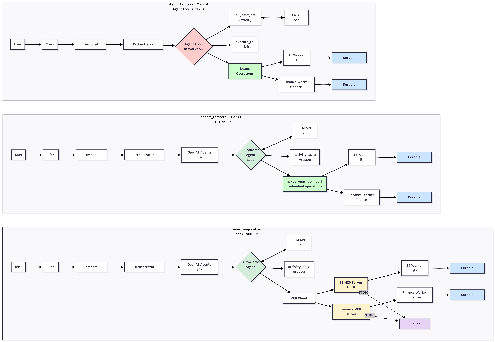

# Durable AI Agent Reference Implementations

This repository demonstrates three patterns for building production-grade AI agents with Temporal, showcasing different approaches to tool orchestration and cross-team collaboration.

## 🎯 Overview

All three implementations share a common goal: **enabling AI agents to leverage external tools durably while allowing different teams to own and operate their services independently**.

### Three Implementation Patterns

| Project | Description | Tools Pattern | Best For |
|---------|-------------|---------------|----------|
| **litellm_temporal** | Pure Python with Temporal Nexus | Nexus endpoints across namespaces | Multi-team environments with service ownership |
| **openai_temporal** | OpenAI Agents SDK + Temporal Nexus | Nexus endpoints with SDK integration | Teams wanting Agents SDK with cross-namespace tools |
| **openai_temporal_mcp** | OpenAI Agents SDK + MCP | MCP servers (HTTP/STDIO) | Standard MCP protocol with durable workflows |



### Common Features

- **LiteLLM Integration**: All implementations use [LiteLLM](https://github.com/BerriAI/litellm) for LLM abstraction, supporting OpenAI, Anthropic, Google, Azure, and 100+ providers
- **Durable Execution**: Temporal workflows ensure agent loops survive failures and restarts
- **Tool Durability**: External tool calls are tracked in workflow history
- **Team Autonomy**: Each service (IT, Finance) operates in its own namespace/server with independent deployment
- **Multi-turn Conversations**: Stateful agent interactions with conversation memory

---

## 📁 Project Structure

```
durable-agent-loop-reference-implementation/
├── litellm_temporal/          # Pure Python + Temporal Nexus
│   ├── orchestrator_worker.py
│   ├── it_nexus_worker.py
│   └── finance_nexus_worker.py
├── openai_temporal/           # OpenAI Agents SDK + Nexus
│   ├── orchestrator_worker.py
│   ├── it_nexus_worker.py
│   └── finance_nexus_worker.py
├── openai_temporal_mcp/       # OpenAI Agents SDK + MCP
│   ├── orchestrator_worker.py
│   ├── it_worker.py
│   ├── finance_worker.py
│   └── mcp_servers/
│       ├── it_mcp_server.py
│       └── finance_mcp_server.py
├── infrastructure/            # Terraform for Temporal Cloud
│   └── (namespaces, nexus endpoints)
└── README.md
```

---

## 🚀 Quick Start

### Prerequisites

- **Temporal CLI**: `brew install temporal` (macOS) or [download](https://docs.temporal.io/cli)
- **uv**: `curl -LsSf https://astral.sh/uv/install.sh | sh`
- **LLM API Key**: Copy `.env.example` to `.env` and add your API key:
  ```bash
  # Choose one:
  OPENAI_API_KEY=sk-...
  ANTHROPIC_API_KEY=sk-ant-...
  # Or any other LiteLLM-supported provider
  ```

### Choose Your Implementation

<details>
<summary><b>Option 1: litellm_temporal (Pure Python + Nexus)</b></summary>

#### Setup
```bash
cd litellm_temporal

# Install dependencies
uv sync

# Start Temporal Server (separate terminal)
temporal server start-dev

# Create namespaces (local dev only)
temporal operator namespace create it-namespace
temporal operator namespace create finance-namespace

# Create Nexus endpoints
temporal operator nexus endpoint create \
    --name it-nexus-endpoint \
    --target-namespace it-namespace \
    --target-task-queue it-task-queue

temporal operator nexus endpoint create \
    --name finance-nexus-endpoint \
    --target-namespace finance-namespace \
    --target-task-queue finance-task-queue
```

#### Start Workers (each in separate terminal)
```bash
uv run orchestrator_worker.py
uv run it_nexus_worker.py
uv run finance_nexus_worker.py
```

#### Run Agent
```bash
uv run start_workflow.py
```

</details>

<details>
<summary><b>Option 2: openai_temporal (Agents SDK + Nexus)</b></summary>

#### Setup
```bash
cd openai_temporal

# Follow same setup as litellm_temporal above
```

#### Start Workers
```bash
uv run orchestrator_worker.py
uv run it_nexus_worker.py
uv run finance_nexus_worker.py
```

#### Run Agent
```bash
uv run start_workflow.py
```

</details>

<details>
<summary><b>Option 3: openai_temporal_mcp (Agents SDK + MCP)</b></summary>

#### Setup
```bash
cd openai_temporal_mcp

# Install dependencies
uv sync

# Start Temporal Server (separate terminal)
temporal server start-dev

# Create namespaces (local dev only)
temporal operator namespace create it-namespace
temporal operator namespace create finance-namespace
```

#### Start All Services (each in separate terminal)
```bash
# MCP Servers
uv run mcp_servers/finance_mcp_server.py
uv run mcp_servers/it_mcp_server.py

# Workers
uv run orchestrator_worker.py
uv run finance_worker.py
uv run it_worker.py
```

#### Run Agent
```bash
uv run start_workflow.py
```

</details>

---

## 💬 Sample Questions

Try these examples to see cross-service orchestration in action:

**Local Tools (Orchestrator)**
- "What is 125 * 8?"
- "What's the weather like in San Francisco?"

**IT Service**
- "What is my IP address?"
- "Get JIRA metrics for project DEMO-456"

**Finance Service**
- "What's the stock price of TSLA?"
- "Calculate ROI for $10,000 at 5% over 10 years"

---

## 🏗️ Architecture Comparison

### litellm_temporal + openai_temporal (Nexus Pattern)

```
┌────────────────────────────────────────────────────────┐
│           Orchestrator Workflow (default namespace)    │
│  • Durable agent loop                                  │
│  • Nexus operations for remote tools (deterministic)   │
│  • Local activities for calculator, weather, LLM       │
└──────┬──────────────────────────────┬──────────────────┘
       │                              │
       │ Nexus Operations             │
       │ (Cross-namespace)            │
       ▼                              ▼
┌─────────────────┐          ┌──────────────────┐
│  IT Namespace   │          │ Finance Namespace│
│                 │          │                  │
│ Nexus Handler   │          │ Nexus Handler    │
│ • list_tools    │          │ • list_tools     │
│ • execute_tool  │          │ • execute_tool   │
│        │        │          │        │         │
│        ▼        │          │        ▼         │
│   Workflows     │          │   Workflows      │
│   Activities    │          │   Activities     │
└─────────────────┘          └──────────────────┘
```

### openai_temporal_mcp (MCP Pattern)

```
┌────────────────────────────────────────────────────────┐
│         Orchestrator Workflow (default namespace)      │
│  • OpenAI Agents SDK with Runner.run()                 │
│  • MCP tools accessed via native SDK protocol          │
│  • Local activities for calculator, weather            │
└──────┬──────────────────────────────┬──────────────────┘
       │                              │
       │ MCP HTTP Protocol            │
       │ (Streamable-HTTP transport)  │
       ▼                              ▼
┌─────────────────┐          ┌──────────────────┐
│  IT MCP Server  │          │Finance MCP Server│
│  (port 8002)    │          │  (port 8001)     │
│                 │          │                  │
│  FastMCP        │          │  FastMCP         │
│  • get_ip       │          │  • stock_price   │
│  • get_jira_    │          │  • calculate_roi │
│    metrics      │          │                  │
│        │        │          │        │         │
│        ▼        │          │        ▼         │
│ IT Namespace    │          │ Finance Namespace│
│   Workflows     │          │   Workflows      │
│   Activities    │          │   Activities     │
└─────────────────┘          └──────────────────┘
```

---

## 🔍 Key Architectural Decisions

### Nexus Pattern (litellm_temporal, openai_temporal)

**Tool Discovery**: One-time deterministic Nexus call at workflow start
```python
# Discover remote tools from Nexus endpoints
tools = await workflow.execute_nexus_operation(
    "it-nexus-endpoint",
    "list_tools",
)
```

**Tool Execution**: Deterministic Nexus calls during agent loop
```python
result = await workflow.execute_nexus_operation(
    endpoint_name,
    "execute_tool",
    {"tool_name": "get_ip", "args": {}},
)
```

**Benefits**:
- ✅ Native Temporal cross-namespace communication
- ✅ Full workflow history includes remote tool calls
- ✅ Team autonomy - each namespace independently deployable

**Trade-offs**:
- ⚠️ Requires Temporal infrastructure setup (namespaces, endpoints)
- ⚠️ Current demo uses synchronous Nexus operations (see Production Recommendations below)

### MCP Pattern (openai_temporal_mcp)

**Tool Discovery**: Automatic via OpenAI Agents SDK plugin
```python
client = await Client.connect(
    plugins=[OpenAIAgentsPlugin(
        mcp_server_providers=[
            StatelessMCPServerProvider(
                name="finance",
                server_factory=create_finance_server
            )
        ]
    )]
)
```

**Tool Execution**: SDK handles MCP protocol transparently
```python
# SDK automatically calls MCP tools based on agent decisions
result = await Runner.run(agent, input=user_message)
```

**Benefits**:
- ✅ Standard MCP protocol (works with Claude Desktop, Goose, etc.)
- ✅ Simpler setup - no Nexus endpoint configuration
- ✅ Both HTTP and STDIO transports supported

**Trade-offs**:
- ⚠️ MCP servers must be reachable via HTTP (in this implementation)
- ⚠️ Separate processes for MCP servers

---

## ⚠️ Production Recommendations

### Current Demo Trade-offs

All implementations prioritize **simplicity for demonstration**. For production use, consider these enhancements:

#### 1. Nexus Handler Implementation

**Current (Demo)**:
```python
@nexusrpc.handler.sync_operation
async def execute_tool(self, ctx, input):
    activities = ITActivities()
    result = await activities.jira_metrics(...)  # Direct function call
    return result
```

- ❌ No automatic retries if function fails
- ❌ No Temporal durability features
- ❌ Limited observability

**Production Recommendation**:
```python
@nexus.workflow_run_operation
async def execute_tool(self, ctx, input) -> nexus.WorkflowHandle:
    return await ctx.start_workflow(
        ITToolWorkflow.run,
        input,
        id=f"it-tool-{uuid.uuid4()}",
    )
```

- ✅ Full Temporal durability and retry logic
- ✅ Activity execution with proper timeouts/retries
- ✅ Better observability via workflow history

#### 2. Authentication & Authorization

**TODO**: Implement auth token passing using Temporal interceptors

The pattern should:
1. User authenticates with orchestrator agent
2. Auth token passed via workflow headers (interceptor)
3. Token propagated through Nexus calls / MCP requests
4. Tool services validate token before execution

Example implementation:
```python
# Orchestrator - add token to headers
class AuthInterceptor(Interceptor):
    def intercept_workflow(self, input):
        input.headers["auth_token"] = get_user_token()
        return next.start_workflow(input)

# Tool service - validate token
class ValidateAuthInterceptor(Interceptor):
    def intercept_activity(self, input):
        token = input.headers.get("auth_token")
        if not validate_token(token):
            raise Unauthorized()
        return next.execute_activity(input)
```

#### 3. Context Window Management

Current implementations do not manage LLM context windows. For production:
- Implement conversation summarization
- Sliding window for message history
- Tool result truncation for large outputs

#### 4. Error Handling

Add production-grade error handling:
- Graceful degradation when services unavailable
- Circuit breakers for failing services
- User-friendly error messages

---

## ☁️ Temporal Cloud Deployment

### Using Terraform (infrastructure/)

The `infrastructure/` directory contains Terraform code for provisioning Temporal Cloud resources:

```bash
cd infrastructure

# Configure Temporal Cloud credentials
export TEMPORAL_CLOUD_API_KEY=your-key

# Review planned changes
terraform plan

# Create namespaces and Nexus endpoints
terraform apply
```

**Resources Created**:
- Temporal Cloud namespaces (`default`, `it-namespace`, `finance-namespace`)
- Nexus endpoints for cross-namespace communication
- Required RBAC permissions

After deployment, update `app/shared.py` in each project with your Cloud namespace IDs and endpoint names.

---

## 🔧 Development

### Project Dependencies

All projects use:
- **temporalio**: Temporal Python SDK
- **litellm**: LLM provider abstraction
- **pydantic**: Data validation
- **fastmcp** (MCP project only): FastMCP framework

### Environment Variables

```bash
# LLM Provider (choose one)
OPENAI_API_KEY=sk-...
ANTHROPIC_API_KEY=sk-ant-...

# Temporal (optional, defaults to localhost)
TEMPORAL_ADDRESS=localhost:7233

# MCP Servers (optional, defaults shown)
FINANCE_MCP_PORT=8001
IT_MCP_PORT=8002
```

### Running Tests

```bash
# In each project directory
uv run pytest
```

### Troubleshooting

**Non-OpenAI Model Warnings**: When using non-OpenAI models (e.g., Anthropic Claude, Gemini), you may see harmless tracing warnings in the OpenAI Agents SDK projects:
```
Current span is not a FunctionSpanData, skipping tool output
OPENAI_API_KEY is not set, skipping trace export
```
These warnings are expected and do not affect functionality. The OpenAI Agents SDK includes optional tracing features that attempt to export traces to OpenAI when available.

---

## 📊 Observability

### Temporal Web UI

1. Open `http://localhost:8233` (local) or your Temporal Cloud URL
2. Find your workflow execution
3. Observe:
   - **Nexus operations** (litellm_temporal, openai_temporal): See calls to IT/Finance endpoints in Nexus tab
   - **Activity executions**: Local tool calls (calculator, weather, LLM)
   - **Workflow history**: Complete audit trail of agent decisions

### Worker Logs

Each worker outputs structured logs showing:
- Tool discovery at startup
- Tool execution with parameters
- Results returned to orchestrator

---

## 🤝 Contributing

This is a reference implementation for educational purposes. Contributions welcome:
- Bug fixes
- Documentation improvements
- Additional tool examples
- Production hardening patterns

---

## 📝 TODOs

- [ ] **Auth Token Propagation**: Implement interceptor-based authentication from user → orchestrator → tool services
- [ ] **Context Window Management**: Add conversation summarization and sliding window
- [ ] **Production Nexus Handlers**: Convert sync operations to workflow_run_operation pattern
- [ ] **Error Recovery**: Add circuit breakers and graceful degradation
- [ ] **Observability**: Add structured logging, metrics, and tracing
- [ ] **Testing**: Add integration tests for cross-namespace scenarios

---

## ⚖️ License

MIT

---

## 🙏 Acknowledgments

- [Temporal](https://temporal.io) - Durable execution platform
- [OpenAI Agents SDK](https://github.com/openai/openai-agents-python) - Agent framework
- [LiteLLM](https://github.com/BerriAI/litellm) - LLM provider abstraction
- [FastMCP](https://github.com/jlowin/fastmcp) - MCP server framework
