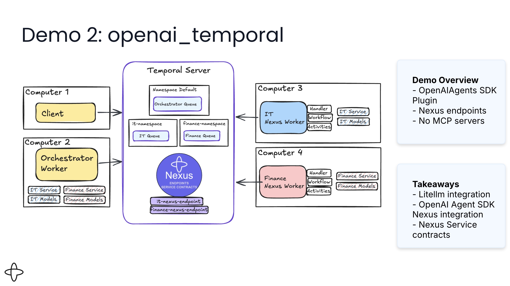
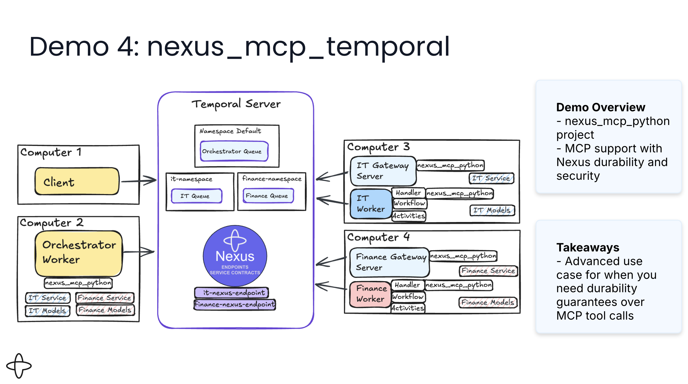

# Durable AI Agent Reference Implementations

This repository demonstrates four patterns for building AI agents with Temporal, showcasing different approaches to tool orchestration and cross-team collaboration.

▶️ [Watch the full walkthrough on YouTube](https://www.youtube.com/watch?v=i7NeaKnccDE)

## 🎯 Overview

All implementations share a common goal: **enabling AI agents to leverage external tools durably while allowing different teams to own and operate their services independently**.

### Four Implementation Patterns

| Project | Description | Tools Pattern | Best For | Video |
|---------|-------------|---------------|----------|-------|
| **litellm_temporal** | Pure Python with Temporal Nexus | Nexus endpoints across namespaces | Multi-team environments with service ownership | [▶️](https://youtu.be/i7NeaKnccDE?si=4zNAan62nNY3RLMS&t=571) |
| **openai_temporal** | OpenAI Agents SDK + Temporal Nexus | Nexus endpoints with SDK integration | Teams wanting Agents SDK with cross-namespace tools | [▶️](https://youtu.be/i7NeaKnccDE?si=Zd-JMpxSil_7lN2l&t=1072) |
| **openai_temporal_mcp** | OpenAI Agents SDK + MCP (HTTP) | MCP servers via HTTP/STDIO transport | Standard MCP protocol with durable workflows | [▶️](https://youtu.be/i7NeaKnccDE?si=2blgNBg2z3mr8Ny1&t=1287) |
| **nexus_mcp_temporal** | OpenAI Agents SDK + MCP Gateway (Nexus) | Dynamic discovery via WorkflowTransport | Deterministic MCP + Dynamic tools + External clients | [▶️](https://youtu.be/i7NeaKnccDE?si=5PvlwEiUNvArt7jh&t=1729) |

### Architecture Diagrams

**litellm_temporal** — Pure Python agent loop with direct Nexus calls

**openai_temporal** — OpenAI Agents SDK with Nexus endpoints

**openai_temporal_mcp** — OpenAI Agents SDK with MCP servers over HTTP

**nexus_mcp_temporal** — OpenAI Agents SDK with MCP Gateway (Nexus-backed)

### Common Features

- **LiteLLM Integration**: All implementations use [LiteLLM](https://github.com/BerriAI/litellm) for LLM abstraction, supporting OpenAI, Anthropic, Google, Azure, and 100+ providers
- **Durable Execution**: Temporal workflows ensure agent loops survive failures and restarts
- **Tool Durability**: External tool calls are tracked in workflow history
- **Team Autonomy**: Each service (IT, Finance) operates in its own namespace/server with independent deployment
- **Multi-turn Conversations**: Stateful agent interactions with conversation memory
