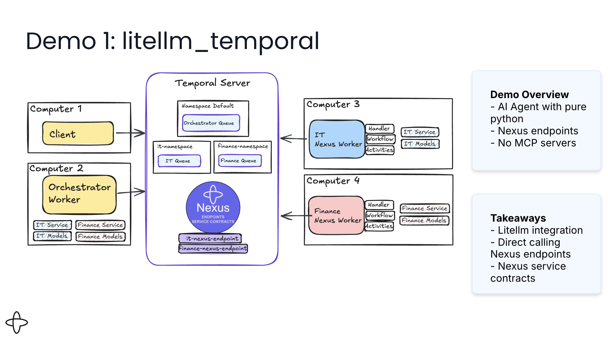

# Durable Agent Loop - LiteLLM Implementation

**Approach:** AI agent orchestration with LiteLLM for multi-provider LLM support

This implementation demonstrates a complete durable agent loop built with:
- **AI agent orchestration** - Explicit while loop with full control over agent decisions
- **LiteLLM** - Support for any LLM provider (OpenAI, Anthropic Claude, Google Gemini, etc.)
- **Temporal activities** - Plan next action and execute tools as durable activities
- **Nexus operations** - Cross-namespace tool execution (IT and Finance services)
- **Manual conversation memory** - Explicit tracking of conversation history
- **Multi-turn conversations** - Interactive chat via Temporal Updates

## Architecture



### Components

1. **Orchestrator Workflow** (`app/workflow.py`)
   - Main agent loop (while True)
   - Manual conversation history tracking
   - Manual tool routing and execution
   - Nexus client creation and operation calls

2. **Activities** (`app/activities.py`)
   - `plan_next_action()` - LLM decides next step (uses LiteLLM)
   - `execute_tool()` - Execute local tools (calculator, echo)

3. **Nexus Services** (Remote namespaces)
   - IT Service: jira_metrics, get_ip
   - Finance Service: stock_price, calculate_roi

4. **Workers**
   - `orchestrator_worker.py` - Main workflow and activities
   - `it_nexus_worker.py` - IT tools in separate namespace
   - `finance_nexus_worker.py` - Finance tools in separate namespace

5. **Client** (`client.py`)
   - Interactive CLI for multi-turn conversations
   - Uses Temporal Updates for request/response

## Prerequisites

1. **Temporal Server** running locally:
   ```bash
   temporal server start-dev
   ```

2. **Python 3.11+** with uv:
   ```bash
   # Install uv if needed
   curl -LsSf https://astral.sh/uv/install.sh | sh
   ```

3. **LLM API Key** (OpenAI, Anthropic, etc.):
   ```bash
   # For OpenAI
   export OPENAI_API_KEY=your_key_here

   # For Anthropic
   export ANTHROPIC_API_KEY=your_key_here
   ```

## Setup

1. **Navigate to this directory:**
   ```bash
   cd litellm_temporal
   ```

2. **Install dependencies:**
   ```bash
   uv sync
   ```

3. **Set up environment:**
   ```bash
   cp .env.example .env
   # Edit .env and add your API key
   ```

4. **Create Nexus endpoints** (one-time setup):
   ```bash
   # Create namespaces
   temporal operator namespace create --namespace it-namespace
   temporal operator namespace create --namespace finance-namespace

   # Create Nexus endpoints
   temporal operator nexus endpoint create \
     --name it-nexus-endpoint \
     --target-namespace it-namespace \
     --target-task-queue it-task-queue

   temporal operator nexus endpoint create \
     --name finance-nexus-endpoint \
     --target-namespace finance-namespace \
     --target-task-queue finance-task-queue
   ```

## Running the Demo

In addition to the server, you need **4 terminal windows** running simultaneously:

### Terminal 1: IT Nexus Worker
```bash
cd litellm_temporal
uv run it_nexus_worker.py
```

### Terminal 2: Finance Nexus Worker
```bash
cd litellm_temporal
uv run finance_nexus_worker.py
```

### Terminal 3: Orchestrator Worker
```bash
cd litellm_temporal
uv run orchestrator_worker.py
```

### Terminal 4: Client (Interactive Chat)
```bash
cd litellm_temporal
uv run client.py
```

## Example Interactions

```
You: Calculate 15 * 23
Agent: The result is 345.

You: What is my IP address?
Agent: Your IP address is 172.16.0.1

You: What is the stock price of AAPL?
Agent: The current stock price of AAPL is $185.50

You: Calculate the ROI for $10000 invested at 5% for 10 years
Agent: The ROI for $10,000 invested at 5% annually over 10 years is $16,288.95

You: quit
```

## Switching LLM Providers

This implementation uses LiteLLM, so you can easily switch providers by:

1. **Edit `app/llm_client.py`** and change the model:
   ```python
   # For OpenAI (default)
   model="gpt-4"

   # For Anthropic Claude
   model="claude-3-5-sonnet-20241022"

   # For Google Gemini
   model="gemini/gemini-pro"
   ```

2. **Set appropriate API key:**
   ```bash
   # For Claude
   export ANTHROPIC_API_KEY=your_key

   # For Gemini
   export GOOGLE_API_KEY=your_key
   ```

3. **Restart workers** for changes to take effect

## Learn More

- [Temporal Documentation](https://docs.temporal.io)
- [Temporal Nexus](https://docs.temporal.io/nexus)
- [LiteLLM Providers](https://docs.litellm.ai/docs/providers)
- [Temporal Python SDK](https://github.com/temporalio/sdk-python)
