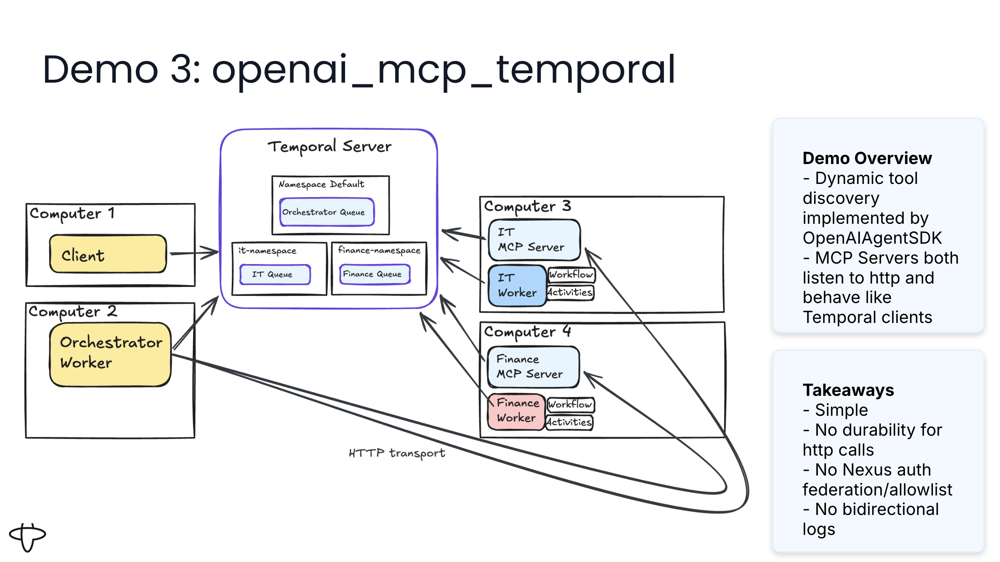

# Durable Agent Loop - OpenAI Agents SDK with MCP Integration

**Approach:** OpenAI Agents SDK with HTTP-accessible MCP servers

▶️ [Watch this demo on YouTube](https://youtu.be/i7NeaKnccDE?si=2blgNBg2z3mr8Ny1&t=1287)

This implementation demonstrates a complete durable agent loop built with:
- **OpenAI Agents SDK** - Automatic agent orchestration via Runner.run()
- **Model Context Protocol (MCP)** - Industry-standard protocol for AI tool integration
- **Direct HTTP communication** - Orchestrator calls MCP servers directly (no Nexus layer)
- **LiteLLM integration** - Support for any LLM provider (OpenAI, Anthropic Claude, Google Gemini, etc.)
- **Temporal activities** - Local tools wrapped as activities
- **MCP servers with Temporal** - Remote tools backed by durable workflows (IT and Finance services)
- **Automatic conversation memory** - SDK manages conversation history
- **Multi-turn conversations** - Interactive chat via Temporal Updates


## Architecture



### Components

1. **Orchestrator Workflow** (`app/workflow.py`)
   - OpenAI Agent SDK integration with Runner.run()
   - Automatic agent loop and conversation history
   - Local tools via activity_as_tool()
   - Remote MCP tools via HTTP activity wrappers

2. **Activities** (`app/activities.py`)
   - Local tools: calculator, weather
   - MCP tool wrappers: HTTP calls to MCP servers (Finance, IT)
   - All wrapped as activities for durability

3. **MCP Servers** (`mcp_servers/*.py`)
   - **Finance MCP (Stateless)**: stock_price, calculate_roi
     - HTTP server on port 8001
     - Each call starts an independent workflow
     - Temporal workflows provide durability
   - **IT MCP (Stateful)**: set_jira_project, get_jira_metrics, track_ip, get_ip_history
     - HTTP server on port 8002
     - Maintains session state via long-running workflow
     - Signals/queries for stateful operations
   - Each server uses Pydantic models for inputs (Temporal best practice)
   - Accessible via HTTP (internal) and STDIO (external clients like Claude Desktop)

4. **Workers**
   - `orchestrator_worker.py` - Main workflow with OpenAI Agents SDK (default namespace)
   - `finance_worker.py` - Executes Finance workflows on QUEUE_FINANCE (finance-namespace)
   - `it_worker.py` - Executes IT workflows on QUEUE_IT (it-namespace)

5. **Client** (`client.py`)
   - Interactive CLI for multi-turn conversations
   - Uses Temporal Updates for request/response

## Prerequisites

1. **Temporal Server** running locally:
   ```bash
   temporal server start-dev
   ```

2. **Python 3.11+** with uv:
   ```bash
   # Install uv if needed
   curl -LsSf https://astral.sh/uv/install.sh | sh
   ```

3. **LLM API Key** (OpenAI, Anthropic, etc.):
   ```bash
   # For OpenAI
   export OPENAI_API_KEY=your_key_here

   # For Anthropic
   export ANTHROPIC_API_KEY=your_key_here
   ```

## Setup

1. **Navigate to this directory:**
   ```bash
   cd openai_temporal_mcp
   ```

2. **Install dependencies:**
   ```bash
   uv sync
   ```

3. **Set up environment:**
   ```bash
   cp .env.example .env
   # Edit .env and add your API key
   ```

4. **Create namespaces** (one-time setup):
   ```bash
   # Create namespaces for MCP workflow execution
   temporal operator namespace create --namespace it-namespace
   temporal operator namespace create --namespace finance-namespace
   ```

**Architecture Note:** MCP servers run as independent HTTP processes (ports 8001, 8002). They act as Temporal clients that start durable workflows on dedicated task queues. The orchestrator calls MCP servers via HTTP activities. This provides clean separation: the orchestrator remains simple, while each MCP server manages its own workflows and durability.

## Running the Demo

You need **5 terminal windows** running simultaneously:

### Terminal 1: Finance Worker
```bash
cd openai_temporal_mcp
uv run finance_worker.py
```
Executes Finance workflows/activities on finance-namespace, QUEUE_FINANCE.

### Terminal 2: IT Worker
```bash
cd openai_temporal_mcp
uv run it_worker.py
```
Executes IT workflows/activities on it-namespace, QUEUE_IT.

### Terminal 3: Finance MCP HTTP Server
```bash
cd openai_temporal_mcp
uv run python -m mcp_servers.finance_mcp_server
```
Runs on port 8001. HTTP server that starts Finance workflows via Temporal client.

### Terminal 4: IT MCP HTTP Server
```bash
cd openai_temporal_mcp
uv run python -m mcp_servers.it_mcp_server
```
Runs on port 8002. HTTP server that starts IT workflows via Temporal client (stateful).

### Terminal 5: Orchestrator Worker
```bash
cd openai_temporal_mcp
uv run orchestrator_worker.py
```
Main workflow orchestrator with OpenAI Agents SDK. Calls MCP servers via HTTP activities.

### Terminal 6: Client (Interactive Chat)
```bash
cd openai_temporal_mcp
uv run client.py
```
Interactive CLI for multi-turn conversations.

## Example Interactions

### Local Tools
```
You: Calculate 15 * 23
Agent: The result is 345.

You: What's the weather in New York?
Agent: [Weather information for New York]
```

### Finance MCP (Stateless)
```
You: What is the stock price of AAPL?
Agent: The current stock price of AAPL is $185.50

You: Calculate the ROI for $10000 invested at 5% for 10 years
Agent: The ROI for $10,000 invested at 5% annually over 10 years is $16,288.95
```

### IT MCP (Stateful - Session-based)
```
You: Set the JIRA project to DEMO-123
Agent: ✓ JIRA project set to: DEMO-123

You: Get JIRA metrics
Agent: [Metrics for DEMO-123 project]

You: Track my IP address
Agent: ✓ IP address tracked successfully

You: Show me the IP history
Agent: IP Address History:
  1. 172.16.0.1 (tracked at 2025-01-29T10:30:00)
  2. 172.16.0.2 (tracked at 2025-01-29T11:45:00)

You: quit
```

## External MCP Access (Claude Desktop / Goose)

The MCP servers can be accessed directly by external MCP clients like Claude Desktop or Goose using STDIO transport. This demonstrates the **decoupling strategy**: the same MCP server code serves both internal HTTP clients and external STDIO clients.

**Architecture:**
- **Internal (Orchestrator)**: Orchestrator → HTTP Activity → MCP HTTP Server (port 8001/8002) → Workflows
- **External (Claude)**: Claude Desktop → MCP STDIO subprocess → Workflows

### Claude Desktop Configuration

Add to your Claude Desktop config (`claude_desktop_config.json`):

```json
{
  "mcpServers": {
    "it_mcp_server": {
      "command": "uv",
      "args": [
        "--directory",
        "/path/to/openai_temporal_mcp",
        "run",
        "python",
        "-m",
        "mcp_servers.it_mcp_server",
        "--transport",
        "stdio"
      ]
    },
    "finance_mcp_server": {
      "command": "uv",
      "args": [
        "--directory",
        "/path/to/openai_temporal_mcp",
        "run",
        "python",
        "-m",
        "mcp_servers.finance_mcp_server",
        "--transport",
        "stdio"
      ]
    }
  },
  "preferences": {
    "sidebarMode": "chat"
  }
}

```

### Goose Configuration

Similarly for Goose, configure in your Goose profile to spawn the MCP servers via STDIO.

**Notes:** 

1. Ensure Temporal workers are running before using external MCP clients, as the MCP servers are Temporal clients that submit workflows to be executed durably.
```
cd openai_temporal_mcp
uv run it_worker.py
uv run finance_worker.py
```

2. You might get some warnings on the Temporal server console related to slow gRPC calls. Consider increasing _start_to_close_timeout_ and adding heartbeats if LLM is slow processing.

## Switching LLM Providers

This implementation uses LiteLLM, so you can easily switch providers by:

1. **Edit `.env` file** and change the model:
   ```bash
   # For OpenAI (default)
   LLM_MODEL=gpt-4

   # For Anthropic Claude
   LLM_MODEL=claude-3-5-sonnet-20241022

   # For Google Gemini
   LLM_MODEL=gemini/gemini-pro
   ```

2. **Set appropriate API key in `.env`:**
   ```bash
   # For Claude
   ANTHROPIC_API_KEY=your_key

   # For Gemini
   GOOGLE_API_KEY=your_key
   ```

3. **Restart workers** for changes to take effect


## Conversation Persistence and Crash Recovery

### What is Durable

The current implementation persists the following in Temporal workflow state:
- **Message queue**: Queue of pending user messages
- **Pending response**: Current response being processed
- **Workflow execution history**: All events and state transitions

These survive worker crashes and workflow replays because they're part of Temporal's durable workflow state.

### What is NOT Durable

The OpenAI agent's **conversation history** lives in memory within the `Agent` object and is **not explicitly persisted** to workflow state. This means:
- If the orchestrator worker crashes, the workflow replays but the agent is recreated fresh
- Previous conversation context (what was discussed earlier) is lost
- User will need to re-establish context after recovery
- For persistent conversation, use OpenAI Agents SDK [Session](https://openai.github.io/openai-agents-python/ref/memory/)

### Crash Scenarios

**Orchestrator worker crash**: Workflow replays, but agent loses conversation memory. User needs to provide context again.

**Finance/IT worker crash**: No impact on orchestrator conversation. Namespace independence means remote worker crashes don't affect the agent's state.

### Production Recommendation

For production systems requiring full conversation persistence across crashes:

**Use OpenAI Sessions with an external database** instead of storing conversation history in Temporal workflow state:
1. Store conversation messages in a dedicated database (PostgreSQL, DynamoDB, etc.)
2. Use OpenAI SDK's Session management to track conversation threads
3. Load conversation history from database during workflow initialization (via activity)
4. Temporal workflows remain focused on orchestration, not conversation storage
5. Scales better for long conversations and allows conversation portability

This approach separates concerns: Temporal handles durable orchestration, while your database handles conversation persistence.

## Troubleshooting

**Non-OpenAI Model Warnings:**
When using non-OpenAI models (e.g., Anthropic Claude), you may see harmless tracing warnings:
```
Current span is not a FunctionSpanData, skipping tool output
OPENAI_API_KEY is not set, skipping trace export
```
These warnings are expected and do not affect functionality. The OpenAI Agents SDK includes optional tracing features that attempt to export traces to OpenAI when available.

## Learn More

- [Temporal Documentation](https://docs.temporal.io)
- [Model Context Protocol (MCP)](https://modelcontextprotocol.io)
- [Temporal MCP Integration](https://docs.temporal.io/develop/python/integrations/ai-sdk)
- [LiteLLM Providers](https://docs.litellm.ai/docs/providers)
- [Temporal Python SDK](https://github.com/temporalio/sdk-python)
